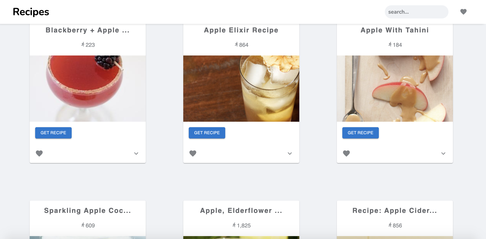
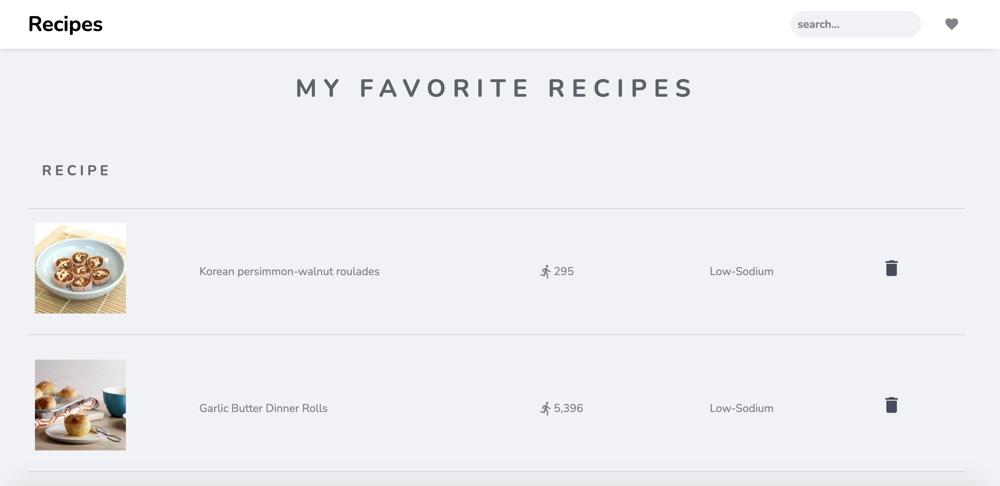
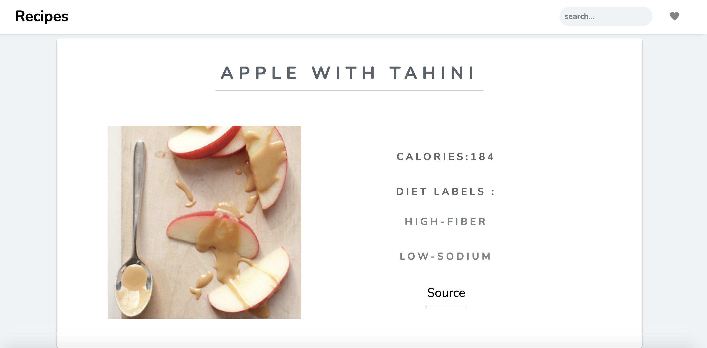

## About the project

---

#### This is a Recipe app.

#### you will find:

- Five types of meal:
  - breakfast
  - lunch
  - dinner
  - snack
  - teatime
- Search multiple recipes.
- Saved the recipes you love in the list.
- Get recipe's details and ingredients.

### Buit with

- [React.js](https://reactjs.org/ "React.js")
- [Redux.js](https://redux.js.org/ "Redux.js")
- [Material-UI](https://mui.com/ "Material-UI")

### Packages

- [Numeral](https://github.com/adamwdraper/Numeral-js "Numeral")
- [AOS](https://github.com/michalsnik/aos "AOS")
- [Slick](https://github.com/akiran/react-slick "Slick")
- [Toastify](https://github.com/fkhadra/react-toastify "Toastify")

## API

---

- [Edamam](https://www.edamam.com/ "Edamam")

## API Notice

---

- API calls limits **10,000 month**
- Results per call **up to 100 results**
- Throttling calls/min **10/minute**

## Usage

---

<h3 align="center">Search recipes </h3>

<h3 align="center">Add favorites</h3>

<h3 align="center">Get recipe details</h3>

## Available Scripts

---

In the project directory, you can run:

### `npm start`

Runs the app in the development mode.\
Open [http://localhost:3000](http://localhost:3000) to view it in the browser.

The page will reload if you make edits.\
You will also see any lint errors in the console.
